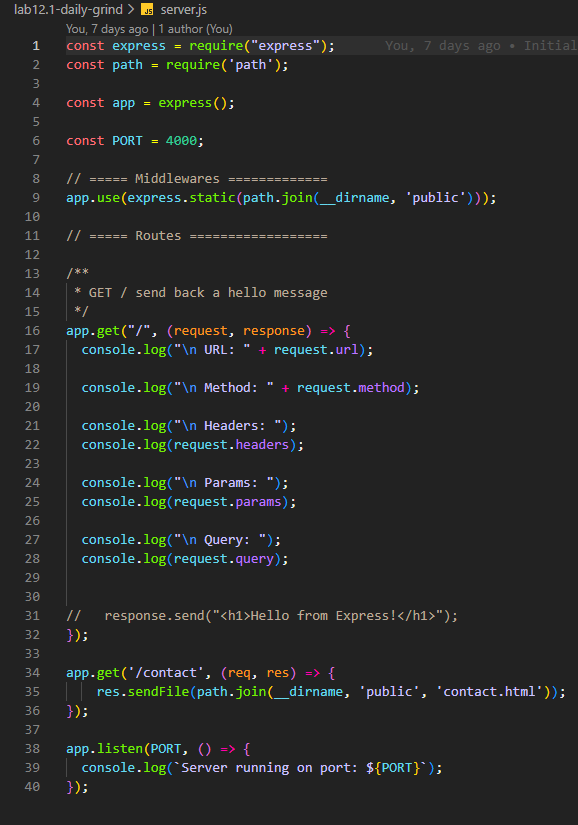

#  Per Scholas Software Engineer Bootcamp Lab 12.1

## Do you want to get ***free*** tech training from Per Scholas? 

## [Click Here to find out how!](https://perscholas.referralrock.com/l/7MIDHLPB/) 

********************************************************************************************************************************************************

# Lab 12.1 - Build a Basic Express.js Server

# Scenario

You have been hired as a freelance developer for a new local coffee shop, “The Daily Grind.” They need a simple website to establish their online presence, but first, they need a backend server to serve the web pages. Your task is to build a basic web server using Node.js and Express that can serve their homepage and a contact page.

# Learning Objectives

By the end of this activity, you will have demonstrated your ability to:

- Set up a Node.js project and manage dependencies.
- Create a basic Express.js server.
- Implement routing to handle specific URL requests.
- Serve static HTML files in response to requests.

# Instructions

## Task 1: Project Setup

Create a new directory for your project (e.g., daily-grind-server).
Navigate into the new directory in your terminal.
Initialize a new Node.js project by running npm init -y. This will create your package.json file.
Install express as a project dependency by running npm install express.

## Task 2: Create the Web Pages

Inside your project directory, create a new folder named public.
Inside the public folder, create two HTML files:
index.html: This will be the homepage. Add a simple heading like <h1>Welcome to The Daily Grind!</h1>.
contact.html: This will be the contact page. Add a heading like <h1>Contact Us</h1> and some placeholder text.

## Task 3: Build the Express Server

In the root of your project directory, create a file named server.js.
Inside server.js, write the code for your Express server. It must do the following:
Import the express library.
Import the built-in path module, which will help you create correct file paths.
Create an instance of an Express application.
Define a port to run the server on (e.g., 3000).
Create a route handler for GET requests to the root URL (/). When this route is requested, it should send the index.html file from your public directory.
Create another route handler for GET requests to /contact. This should send the contact.html file.
Start the server and have it listen on your chosen port. When it starts, it should log a message to the console, like Server is running on port 3000.
Hint: To send a file, you’ll need to provide an absolute path. Use path.join(__dirname, 'public/index.html') to create a reliable path to your HTML files.

# Submission Instructions

Ensure all your files (package.json, server.js, public/index.html, public/contact.html) are in the correct locations.
Verify that your server runs without errors by executing node server.js in your terminal.
Test your routes by visiting http://localhost:3000/ and http://localhost:3000/contact in your browser.
Once complete, submit a link to a GitHub repository containing your project files.

***************************************************************************************************************************************************************

# REFLECTION QUESTIONS: 

1. What is the difference between res.send() and res.sendFile()?

   - res.send() sends text, JSON, or simple HTML strings directly in the response body.
   - res.sendFile() sends an actual file from disk (HTML, image, etc.) as the response.

2. When would you use one over the other?

    Use res.send() for small, dynamic content; use res.sendFile() when you want to serve a full static file like index.html.

3. Why is the path module necessary when serving files?

    The path module builds absolute, OS-safe paths (e.g., path.join(__dirname, "public", "index.html")).

4. What could go wrong if you just used a relative path like 'public/index.html'?

    If you just use 'public/index.html', it can break when:
        - The server is started from a different working directory.
        - The OS uses different path separators (\ vs /).
        - path helps avoid “file not found” and path traversal issues.

5. How would you add a third page (e.g., a menu page) to this server? What steps would you take?

    1. Create the HTML file, e.g. public/menu.html.
     2. In server.js, add a route:
       - app.get("/menu", (req, res) => {res.sendFile(path.join(__dirname, "public", "menu.html"));});
      3. Optionally add a link to it from your other pages (e.g., in index.html, a link <a href="/menu">Menu</a>).